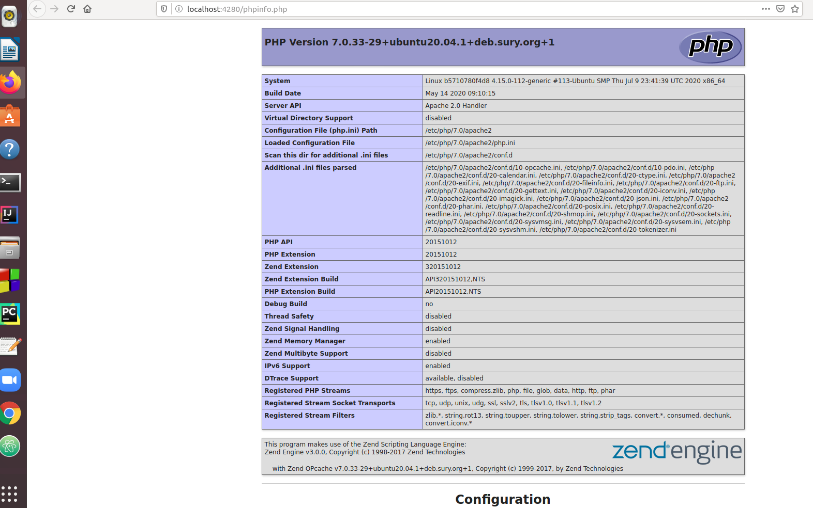
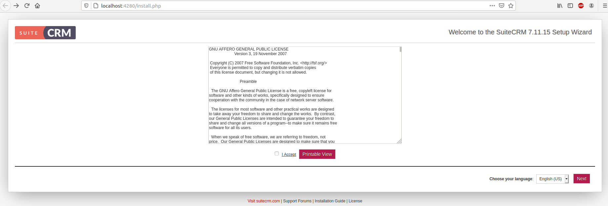
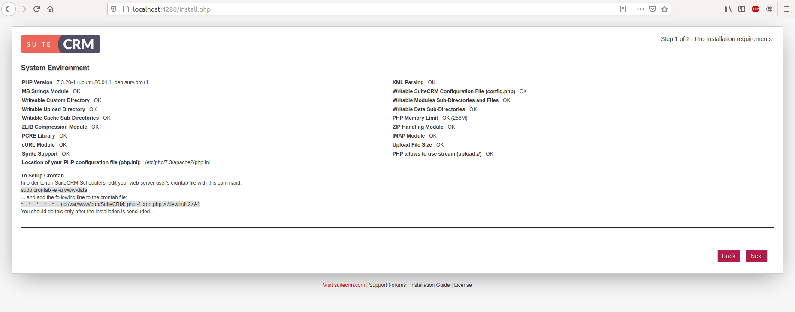
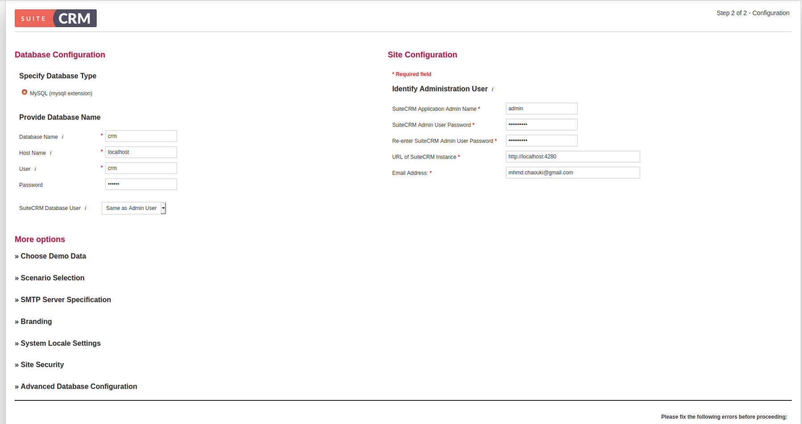
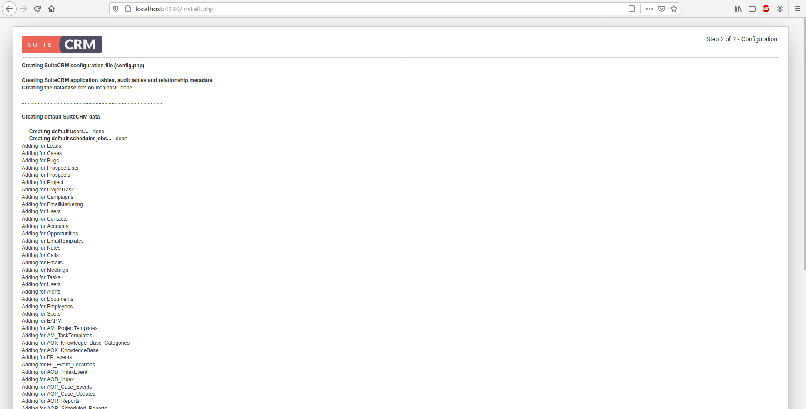
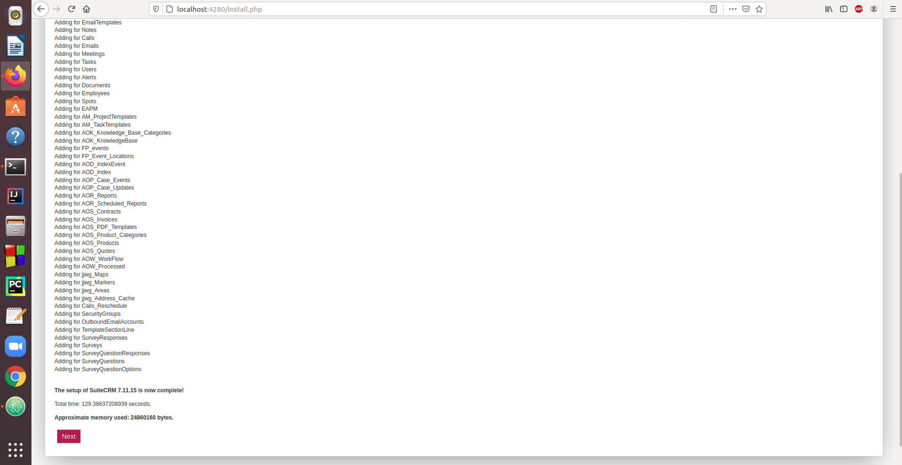
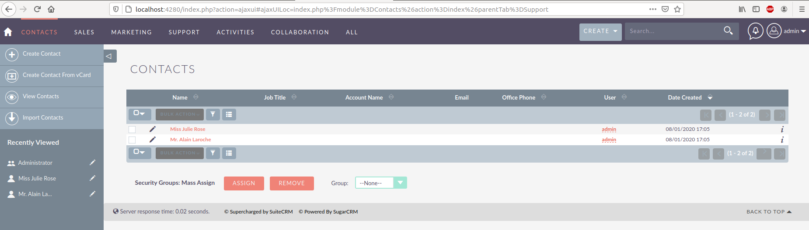
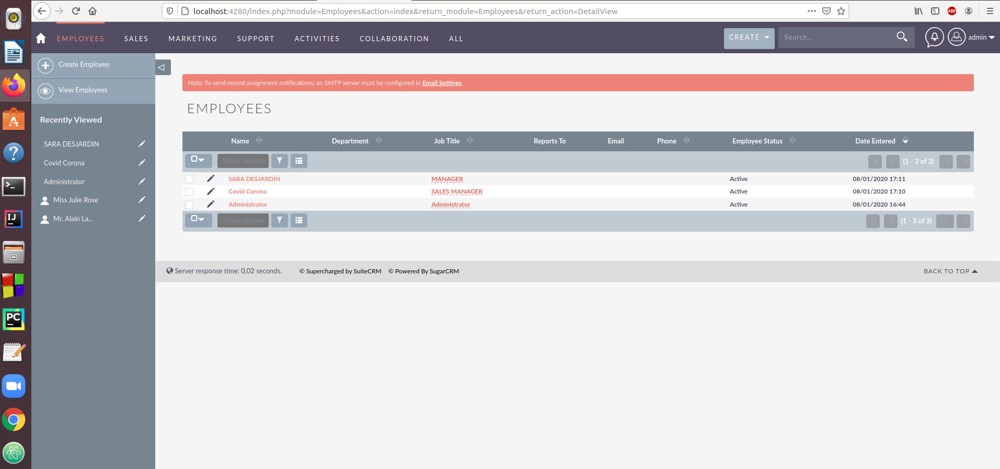
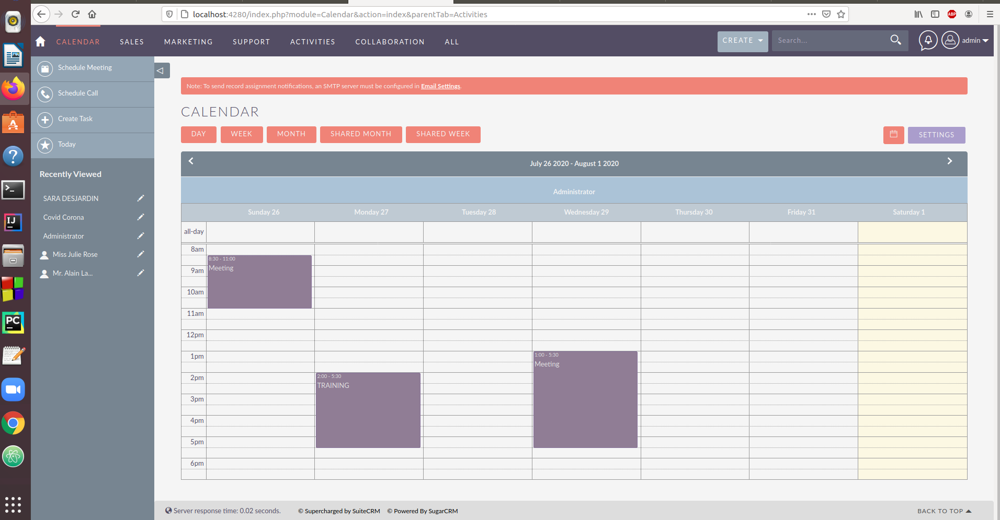
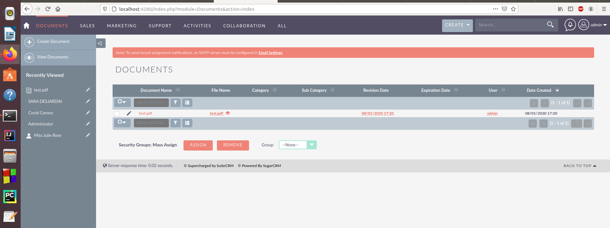

# Rapport du travail pratique 2

- Ce fichier est un modèle pour vous guider dans la rédaction du rapport. La première section (et le début de la section 2) vous montrent des exemples (à compléter). Dans la cinquième section, vous trouverez un exemple de comment insérer une image dans ce fichier Markdown.
- Assurez-vous de metre **toutes** les informations demandées dans l'énoncé.
- Donner les extraits de tous les fichiers de configuration modifiés, créer des liens vers les fichiers créés ou pertinents, afficher les captures d'écran... dans les sections appropriées.
- Supprimer tous les commentaires <!--commentaires--> de votre rapport, avant de le remettre.
- Votre rapport doit respecter le format Markdown, et doit être bien formé. Il doit être clair et agréable à lire une fois traduit en HTML. Vous pouvez utiliser des applications Markdown comme `Typora` ou `Formiko`, par exemple, pour rédiger votre rapport plus facilement.
- Une pénalité être attribuée à un rapport mal formé et difficile à lire.

## Identification de l'auteur

- Cours      : Utilisation et administration des systèmes informatiques
- Sigle      : INF1070
- Session    : Été 2020
- Enseignant : `tsheke johnny`
- Auteur     : `CHAOUKI MOHAMED` (`CHAM27088802`) (`chaouki.mohamed@courrier.uqam.ca`)


## 1. Identification du système d'exploitation

### 1.1 Système d'exploitation

J'ai crée le container avec les commandes suivantes :
~~~bash
sudo docker build -t inf1070:suitecrm -f Dockerfile .

sudo docker create -it --name suitecrm  -p 4280:4280 \
     --mount src=`pwd`/,target=/inf1070,type=bind \
      inf1070:suitecrm  /bin/bash

sudo docker container start suitecrm

docker exec -it -u admincrm suitecrm /bin/bash
~~~


La commande `lsb_release -a` affiche les informations spécifiques relatives à la distribution linux de la machine ainsi que le numéro de la version, le nom de code de la version est "focal", et l'identifiant du distributeur est "Ubuntu".
~~~bash
$ lsb_release  -a

No LSB modules are available.
Distributor ID:	Ubuntu
Description:	Ubuntu 20.04.1 LTS
Release:	20.04
Codename:	focal
~~~

Je me suis connecté en tant que root pour avoir les droits.

```bash
$ sudo -s
```
J'ai fait une mise a jour du système avec la commande suivante :

```bash
apt full-upgrade
```

J'ai enregistré les paquets installés sur la machine dans un fichier texte en utilisant la commande suivante :

```bash
apt list --installed > paquetsInit.txt
```
J'ai copié le fichier `paquetsInit.txt` dans le fichier `paqutages0.txt` en utilisant la commande suivante :
```bash
cp paquetsInit.txt paqutages0.txt
```
Afin de connaître le nombre de paquets installés j'ai utilisé la commande suivante :

```bash
tail -n +2 paqutages0.txt | wc -l
```

J'ai trouvé que ma machine contient `149` paquets .

### 1.2 Liste des paquets installés

La liste des paquets installés est dans le fichier [paqutages0.txt](paqutages0.txt).

### 1.2 Problèmes rencontrés

Je n'ai rencontré aucun problème particulier à cette étape.

## 2. Apache

###  2.1 Installation et configuration

Avec la commande suivante j'ai pu installé apache 2 :

```bash
apt install apache2
```

Avec la commande suivant j'ai pu crée le répertoire `crm`
```bash
mkdir /var/www/crm/
```

Avec la commande suivante j'ai pu envoyé le fichier `index.htm` depuis mon ordinateur au docker :

```bash
cp /inf1070/index.htm /var/www/crm/
```
Avec cette commande je me suis déplacé au répertoire des sites disponibles dans `apache2` :

```bash
cd /etc/apache2/
```
Il faut modifier le fichier `ports.conf` avec la commande suivante afin de changer le port `80` du `VirtualHost` au port `4280`.
```bash
sed -i '5 a Listen 4280' ports.conf
```
Avec cette commande j'ai crée une copie de la configuration par défaut de apache2

```bash
sudo cp 000-default.conf crm.conf
```

Et de changer la ligne du `DocumentRoot` dans le dossier `sites-availables`avec `DocumentRoot /var/www/crm/` afin que le dossier pointe vers notre dossier `crm`.
```bash
sed -i 's/html/crm\//g' crm.conf
```
Il faut aussi configurer `crm.conf` afin d'ajouter l'admin du serveur
```bash
sed -i 's/ServerAdmin webmaster@localhost/ServerAdmin admin@localhost/g' crm.conf
```
Ensuite faut modifier le fichier `crm.conf` avec la commande suivante afin que le port d’écoute soit le `4280`

```bash
sed -i 's/80/4280/g' crm.conf
```
Avec la commande suivante on active le `VirtualHost`  :

```bash
sudo a2ensite crm.conf
```
Une fois la configuration terminée on relance apache2 avec la commande suivante :

```bash
service apache2 reload
```

Voici une capture d’écran de la page `index.htm`


### 2.2 Activation des modules
Enabling module mpm_event.
Enabling module authz_core.
Enabling module authz_host.
Enabling module authn_core.
Enabling module auth_basic.
Enabling module access_compat.
Enabling module authn_file.
Enabling module authz_user.
Enabling module alias.
Enabling module dir.
Enabling module autoindex.
Enabling module env.
Enabling module mime.
Enabling module negotiation.
Enabling module setenvif.
Enabling module filter.
Enabling module deflate.
Enabling module status.
Enabling module reqtimeout.


### Fichiers de configiuration
Enabling conf charset.
Enabling conf localized-error-pages.
Enabling conf other-vhosts-access-log.
Enabling conf security.
Enabling conf serve-cgi-bin.
Enabling site 000-default.

### 2.3 Liste des paquets

La commande suivante nous permet de lister les paquets installés à ce stade

~~~bash
$ sudo apt list --installed > paqutages1.txt
~~~

Afin de connaître le nombre de paquets installés au total j'ai utilisé la commande suivante :

```bash
$ tail -n +2 paqutages1.txt | wc -l
```

J'ai trouvé que ma machine contient `196` paquets .


Voir le fichier [paqutages1.txt](paqutages1.txt).


### 2.4 Problèmes rencontrés

Je n'ai rencontré aucun problème particulier à cette étape.
Ce site m'a aidé pour la configuration :
https://ubuntu.com/tutorials/install-and-configure-apache#1-overview

## 3. PHP - Installation et configuration

### 3.1 Installation et configuration

J'ai commencé par vérifier si `php` était déjà installé.

~~~bash
$ php --version
bash: php : commande introuvable
~~~

J'ai fait un backup du dossier `/etc/`

```bash
cp /etc/ etc.backup/
```

J'ai installé `php7.3`  avec la commande ci-après.

~~~bash
apt install software-properties-common
add-apt-repository ppa:ondrej/php
apt update
apt install php7.3 libapache2-mod-php7.3 php7.3-common php7.3-mysql php7.3-gmp php7.3-curl php7.3-intl php7.3-mbstring php7.3-xmlrpc php7.3-gd php7.3-bcmath php7.3-imap php7.3-xml php7.3-cli php7.3-zip
~~~

La commande suivante nous permet de lister les paquets installés à ce stade

~~~bash
$ sudo apt list --installed > paqutages2.txt
~~~

Afin de connaître le nombre de paquets installés au total j'ai utilisé la commande suivante :

```bash
$ tail -n +2 paqutages2.txt | wc -l
```
Avec cette commande j'ai pu comparé le répertoire `etc/` avec celui du `etc_backup`
```bash
diff -q etc_back/ /etc > resultatDiff.txt
```
Les extraits des fichiers modifiés sont dans le fichier [resultatDiff.txt](resultatDiff.txt.txt).

Avec la commande suivante j'ai pu envoyé le fichier `phpinfo.php` depuis mon ordinateur au docker :

```bash
cp /inf1070/phpinfo.php /var/www/crm/
```
Une fois tout est fini j'ai relance apache2 avec la commande suivante :
```bash
sudo a2enmod php7.3
sudo service apache2 restart
```
Voici le résultat de la page `phpinfo()` 


### 3.2 Liste des paquets installés

J'ai trouvé que ma machine contient `321` paquets .

Voir le fichier [paqutages2.txt](paqutages2.txt).

### 3.3 Problèmes rencontrés

Je n'ai rencontré aucun problème particulier à cette étape.


## 4. MariaDb (MySql) - Installation et configuration

### 4.1 Installation du SGBD, et démarrage du serveur

J'ai installé `MariaDB`  avec la commande ci-après.

~~~bash
sudo apt install mariadb-server mariadb-client php7.3-mysql
~~~
j'ai lancé `MariaDB` avec celle commande :
~~~bash
service mysql start
~~~

Le `UTF8` est déjà activé.


### 4.2 Base de données : utilisateur, BD, mot de passe...

Avec cette commande j'ai pu accédé a la base de donnée afin de la configurer
~~~bash
mysql -u root
~~~
Pour créer une base de données au nom de `crm` faut écrire cela :
~~~bash
CREATE DATABASE crm;
~~~

Pour ajouter un utilisateur il faut mettre cette ligne :
~~~bash
CREATE USER 'crm'@'localhost' IDENTIFIED BY 'Dbpass';
~~~
Pour donner a cet utilisateur tous les droits faut mettre cette ligne :
~~~bash
GRANT ALL PRIVILEGES ON crm.* to crm@localhost;
~~~
Pour enregistrer et activer les privilèges faut mettre cette ligne :
~~~bash
FLUSH PRIVILEGES;
~~~
Pour quitter faut faire :
~~~bash
exit
~~~

Avec cette commande on peut tester la base de donnée en entrant comme mot de passe `Dbpass`
~~~bash
mysql -u crm -p crm
~~~

### 4.3 Liste des paquets installés

La commande suivante nous permet de lister les paquets installés à ce stade

~~~bash
$ sudo apt list --installed > paqutages3.txt
~~~

Afin de connaître le nombre de paquets installés au total j'ai utilisé la commande suivante :

```bash
$ tail -n +2 paqutages3.txt | wc -l
```
J'ai trouvé que ma machine contient `363` paquets .

Voir le fichier [paqutages3.txt](paqutages3.txt).

J'ai redémarré `apache2` ensuite
```bash
service apache2 restart
```
### 4.4 Problèmes rencontrés

Je n'ai rencontré aucun problème particulier à cette étape.


## 5. SuiteCRM - Installation et configuration

### 5.1 Installation

j'ai commencé par installé `curl`
```bash
apt install curl
```
Ensuite installé `git`
```bash
apt install git
```
ensuite téléchargé `composer`
```bash
curl -sS https://getcomposer.org/installer | sudo php -- --install-dir=/usr/local/bin --filename=composer
```
J'ai téléchargé du `git` `SuiteCRM` et le mettre dans le dossier qu'on veut avec la commande suivante :
```bash
git clone https://github.com/salesagility/SuiteCRM.git /var/www/crm
```
On enlève les deux fichier `index.htm` et `phpinfo.php` et on déplace les fichiers de `SuiteCRM` dans le répertoire `crm`
```bash
rm index.htm phpinfo.php

cd SuiteCRM/

mv ./* ../

cd ..

rm -rf SuiteCRM/
```
Puis on installe le `composer` depuis le dossier `/var/www/crm`
```bash
composer install --no-dev
```
il faut donner les permissions a l'aide des commandes suivantes :
```bash
chown -R www-data:www-data /var/www/crm/
chmod -R 755 /var/www/crm/
```


#### 5.1.1 Liste des paquets installés

Voir le fichier [paquetsPrerequis.txt](paquetsPrerequis.txt).
Le nombre de fichier installe a date est `376` fichier.

### 5.2 Configuration et démarrage

pour configurer `apache2` il faut aller sur le dossier `/etc/apache2/sites-available/` et modifier le `crm.conf` avec les commandes suivantes :
```bash
sed -i '12 a ServerName localhost\nServerAlias www.localhost\n<Directory \/var\/www\/crm\/>\nOptions FollowSymlinks\nAllowOverride All\nRequire all granted\n<\/Directory>' crm.conf
sed -i '28 a <Directory \/var\/www\/crm\/>\nRewriteEngine on\nRewriteBase \/\nRewriteCond %{REQUEST_FILENAME} !-f\nRewriteRule ^(.*) index.php [PT,L]\n<\/Directory>' crm.conf
```
Il faut aussi configurer le fichier `php.ini` qui est dans le répertoire `/etc/php/7.3/apache2/` avec les commandes suivantes :
```bash
cd /etc/php/7.3/apache2/

sed -i 's/short_open_tag = Off/short_open_tag = On/g' php.ini

sed -i 's/memory_limit = 128M/memory_limit = 256M/g' php.ini

sed -i 's/;date.timezone =/date.timezone = America\/Toronto/g' php.ini

sed -i 's/max_execution_time = 30/max_execution_time = 360/g' php.ini

sed -i 's/upload_max_filesize = 2M/upload_max_filesize = 20M/g' php.ini

sed -i 's/;   extension=mysqli/   extension=mysqli/g' php.ini
```

il faut relancer `apache2` avec les commandes suivantes:
```bash
a2ensite crm.conf
a2enmod rewrite
service apache2 restart
```

### 5.3 Captures d'écrans











## 6. Crontab et backup Bd

Pour installer `cron` il faut faire cette commande :
```bash
echo Y | apt install cron>
```

## 6. Sauvegarde et restauration

### 6.1 Base de données
A l'aide de cette commande on peut faire une sauvegarde de la base de donnée.
```bash
mysqldump -u crm -p crm >~/crm.sql
```

Voir le fichier [crm.sql](crm.sql).

### 6.2 Cron

Voir le fichier paquets [paqutages5.txt](paqutages5.txt).

Le total des fichiers installes est de `377` fichier.

  Prlanification crontab
Pour que `cron` s'exécute à toutes les 5 minutes du lundi au vendredi il faut faire cette commande :
le `1,2,3,4,5` represente les jours et le `5` represente les minutes
```bash
touch /var/spool/cron/crontabs/www-data

sed -i '10 a 5    *    *    *    1,2,3,4,5     cd \/var\/www\/crm; php -f cron.php > \/dev\/null 2>&1' /var/spool/cron/crontabs/www-data
```
